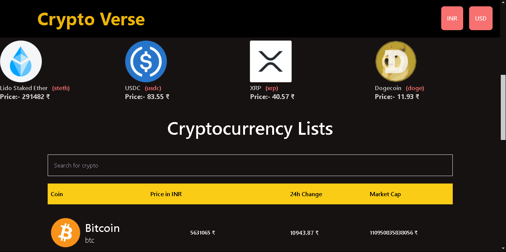

# Crypto Currency Tracker

The Crypto Currency Tracker is built using React and Redux for state management, along with several other modern web development technologies. It aims to provide users with an intuitive interface to search, track, and visualize cryptocurrency data.

## Note:-
This is open source api. It has limited api calls. If you go beyond that limit data will not populate to your screen. 

## Project Demo Link

If You face any problem to open the deploy whole project. You can refer this link. 

https://youtu.be/ZxVXJ2z9Atc?si=UPuV1ejKfpbFxa9F
## Key Features

- Real-Time Data Fetching: Utilizes the CoinGecko API to fetch the latest cryptocurrency data.

- State Management with Redux: Manages the application state efficiently using Redux.

- Carousel Integration: Implements a responsive carousel to showcase different cryptocurrencies using the react-carousel npm package.

- Search Functionality with Debouncing: Allows users to search for cryptocurrencies with a 1-second debounce to optimize performance.

- Data Visualization: Uses react-chart to display cryptocurrency data in an interactive and visually appealing manner.

- Lazy Loading: Implements lazy loading to enhance performance by loading components only when needed.

- Responsive Design: Ensures the application is fully responsive and mobile-friendly using Tailwind CSS.

- Organized Folder Structure: Maintains a clean and organized folder structure for better maintainability.

## Lessons Learned

During the development of this project, the following skills and concepts were reinforced:

- API Integration: Learned how to integrate and fetch data from an external API (CoinGecko API).

- State Management: Gained deeper understanding of Redux for managing complex application states. 

- Performance Optimization: Implemented debouncing and lazy loading to optimize application performance.

- Responsive Design: Enhanced proficiency in creating responsive and mobile-friendly applications using Tailwind CSS. 

- Data Visualization: Improved skills in data visualization by using charts to represent data interactively.
 
- Component-Based Architecture: Strengthened the ability to structure React applications in a modular and maintainable way.

## Screenshots

